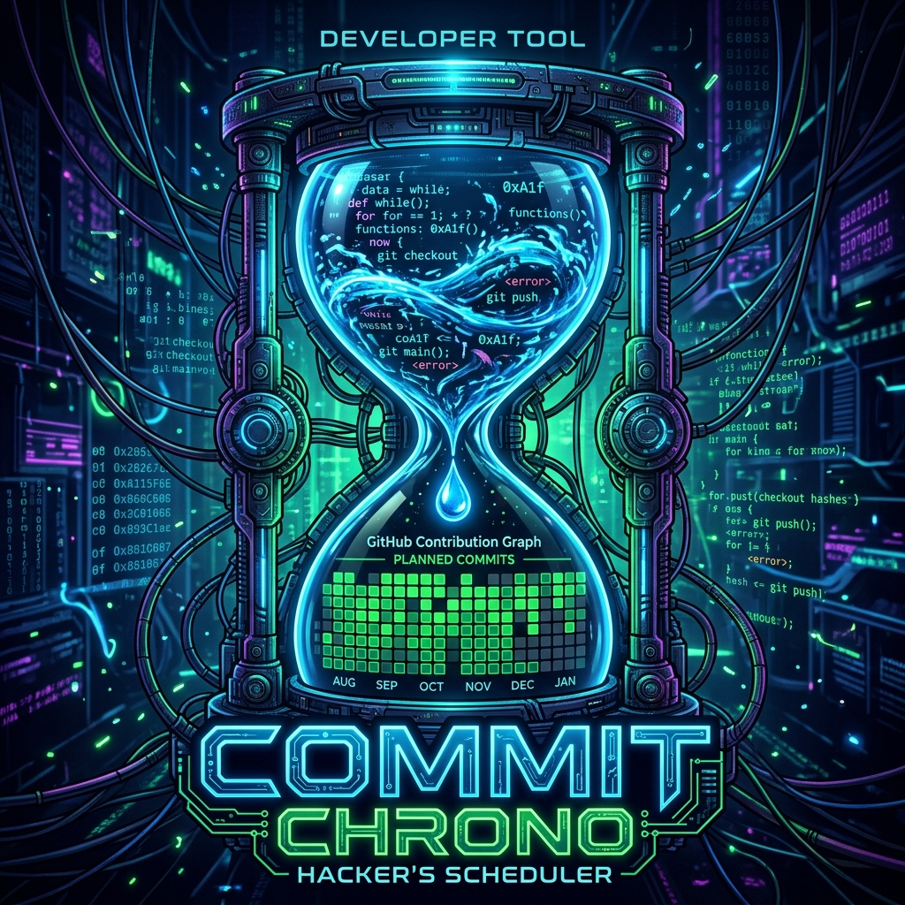

  
  <h1>Commit Chrono</h1>
  
<strong>A Local-First, Privacy-Respecting GitHub Automator.</strong>

---

## 🕒 The Organic Committer

**Commit Chrono** is an advanced desktop application (built with Tauri + React) paired with a background Python Engine that completely automates your GitHub activity graph.

Unlike SaaS platforms that hold your GitHub tokens on central servers, **Commit Chrono runs 100% locally on your hardware**. Your tokens, your code, and your git history never touch our servers.

### Key Features
- 🔒 **Local-First Architecture:** The React UI configures rules that a local Python cron-job executes. Your `GH_PAT` (Personal Access Token) is stored securely on your own hard drive.
- 🔗 **Dependency Queuing:** Drag and drop large features, and tell the engine "Do not push File B until File A is synced".
- 📅 **Date Locking:** Prevent the bot from pushing a specific file before a certain date (`notEligibleUntil`).
- 🔔 **T-Minus Notifications:** Pings your phone (via Discord or Ntfy.sh) 10 minutes before a push, giving you time to hit the glowing **[ABORT PUSH]** button if you spot a bug.
- 🎨 **Deep Customization:** Modify jitter (randomized times), skip dates, and abort behaviors per repository.

---

## ⚡ AI Code Splitter & Streak Protector

Commit Chrono ships with powerful algorithmic tools for your engineering flow:
- **Intelligent Habit Goals:** The bot acts as a streak protector. Select a target like "Weekend Warrior" or "Daily Grind", and if you forget to commit real code, it will ping your phone to remind you to get to work.
- **AI Code Splitter (Gemini):** Placed a huge 1,000-line file in the drop zone after a caffeine-fueled weekend? The AI Code Splitter will automatically reverse-engineer your code and break it into clean, atomic, iterative commits for a perfect git history.

---

## 🚀 Getting Started

1. **Download the Installer:** Grab the `.exe` from the Releases page.
2. **Setup Wizard:** Upon first launch, the app will guide you through generating a GitHub PAT and pasting it into the app.
3. **Configure Notifications:** Enter a [Ntfy.sh](https://ntfy.sh) topic URL (recommended for privacy) or a Discord Webhook.
4. **Fetch Repos:** Click `+ Add Repo` to pull your projects directly from GitHub.
5. **Drop & Forget:** Drag files into the Drop Zone, assign them to a repo, and let the Python engine organically drip-feed them to your GitHub profile.

---

### Architecture 
- **Frontend:** React + Vite, styled with a deep midnight glassmorphic UI.
- **Backend:** Rust (Tauri) handles the fast IPC, reads/writes local `config.json` state, and creates dependency sidecars (`meta.json`).
- **Engine:** Python (`bot/`) acts as the cron-daemon that performs the physical `git push` commands.

*Built for those who code hard locally but want an automated, beautiful GitHub graph.*
